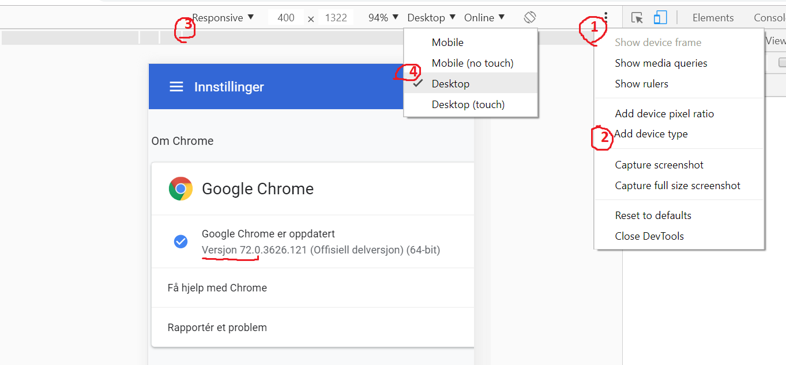

# Spacing JS [edited version]

## Installation

1. chrome 安装 油猴

2. 油猴新建脚本，填入 orphan.js 内容，保存

## Usage

### PC

进入页面，顶部出现加载成功 toast 方可用

鼠标移动到一元素，按住 q 显示其尺寸；不松 q，鼠标移动到另一横向或纵向有交集的元素，显示另一元素的尺寸及两元素距离。

### mobile

进入页面，顶部出现加载成功 toast 方可用

方式一（推荐）：

1. 点击三个点

2. 点击 add device type

3. 选 responsive

4. 选 mobile (no touch)

鼠标移动到到一元素，按住 q 显示其尺寸；不松 q，鼠标移动到另一横向或纵向有交集的元素，显示另一元素的尺寸及两元素距离。

方式二：

鼠标点击一元素，按住 q 显示其尺寸；不松 q，鼠标点击另一横向或纵向有交集的元素，显示另一元素的尺寸及两元素距离。

### PC, mobile 通用额外功能：

按 1 禁用所有点击行为；

按 2 恢复所有点击行为；

按 3 为所有文本外边缘添加容器让其可显示尺寸；
